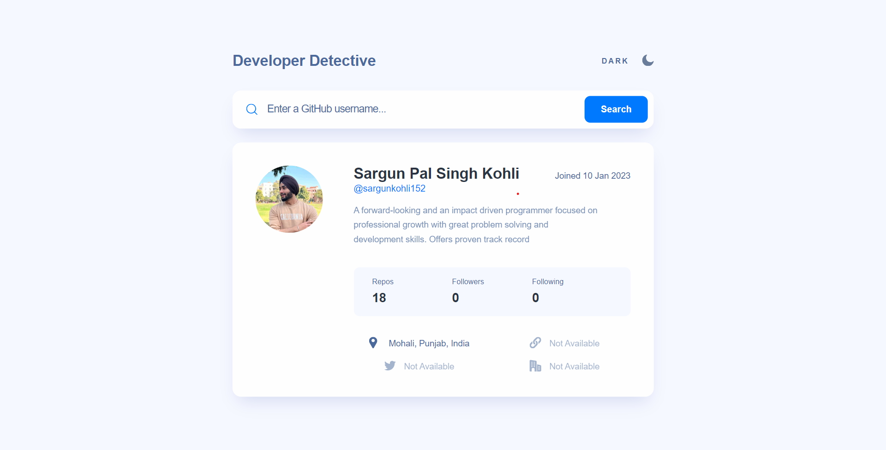
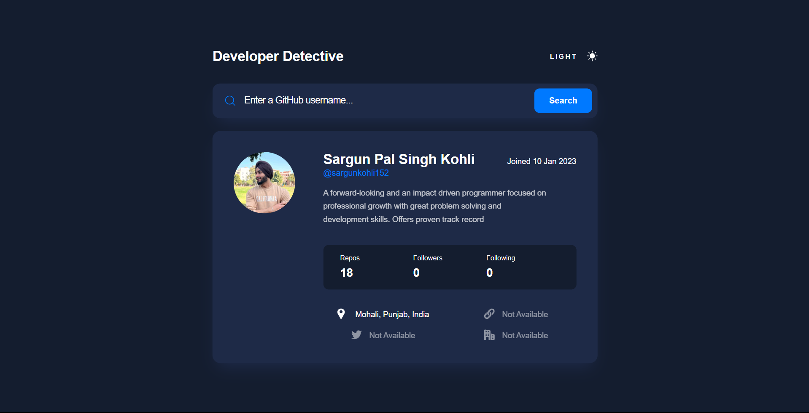
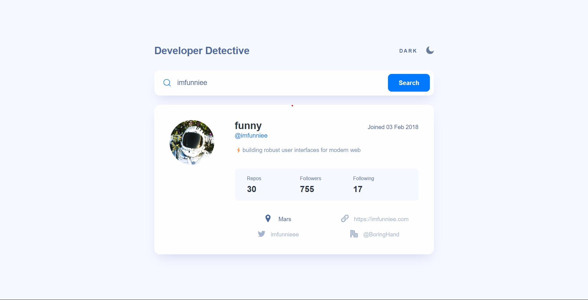

# Dev Detective

Dev Detective is a web project that simplifies the process of searching for GitHub user accounts and provides account details in a user-friendly interface. This project is designed to enhance skills in API usage, web styling, and implementing dark mode in a website.





## Table of Contents

- [Overview](#overview)
- [Installation](#installation)
- [Usage](#usage)
- [Features](#features)
- [Technologies Used](#technologies-used)
- [Contributing](#contributing)
- [License](#license)

## Overview

Dev Detective streamlines the search for GitHub user accounts and offers a user-friendly experience. Key features include:

- **GitHub User Search:** Users can search for any GitHub account by entering a username.

- **Dark Mode:** A dark mode button allows users to switch between light and dark color schemes, enhancing the user experience.

- **User Account Card:** Account details are displayed in a card-like structure, including name, username, number of repositories, followers, followings, and links to social media handles.

The project serves as a valuable exercise in API integration, styling, and UI design.

## Installation

1. Clone the repository:

   ```bash
   git clone https://github.com/sargunkohli152/Dev_Detective.git

2. Start the application in your code editor.

## Usage
 - **GitHub User Search:**
    - Enter a GitHub username in the search bar.
    - Click the search button to fetch account details.
    - Account details will be displayed in the card structure.

 - Dark Mode:
    - Click the dark mode button to switch between light and dark color schemes.

## Features
 - GitHub user search functionality.
 - Dark mode for improved user experience.
 - User account card displaying account details.
 - Social media links for user accounts.

## Technologies Used
 - HTML
 - CSS
 - JavaScript
 - GitHub API (or specify the API used)


## Contributing
Contributions are welcome! If you have any suggestions, improvements, or want to add new features to enhance Dev Detective, please fork the project, make your changes, and submit a pull request.

License
This project is licensed under the MIT License.
